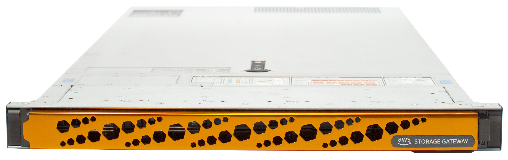

# AWS - Armazenamento e desacoplamento de API

Armazenamento, desacoplamento, solução de arquitetura multi-nível, Alta disponibilidade e/ou tolerância a falhas.

## Volumes efêmeros

É o tipo de armazenamento que já vem por default em algumas instâncias EC2, por exemplo instância t2.micro. Esse tipo de disco é durável apenas enquanto a instância estiver em funcionamento (durabilidade no nível da instância). 

Não recomendado quando se deseja permanecer os dados após parar a instância.

## S3:

Armazenamento de objetos(algo similar ao google drive), <u>grandes volumes</u> de dados ideal para <u>backup arquivos e imagens com alta durabilidade</u>. Tem limite de upload de 5TB por objeto. Tamanho ilimitado. 

Acesso aos dados acontece via API, HTTP ou HTTPS.

Tem recursos como: versionamento, cross-regional, criptografia em trânsito TLS e criptografia em repouso(SSE-SE, SSF-KMS, SSE-C)

Questões de prova S3:

- Compartilhar acesso seguro a um bucket a partir da camada de aplicação com uma instância EC2->Criar uma política de bucket que limite o acesso apenas ao tier de aplicação executando na VPC, Configurar um endpoint de gateway VPC para o bucket dentro do VPC
- Transferência de grandes volumes de dados para o S3 de forma segura para dados sensíveis-> uso do AWS DataSync sobre o AWS Direct Connect
- Dados criptografados em repouso, melhor solução para as chaves serem rotacionadas -> Amazon KMS (SSE-KMS) com rotação automática.
- Impedir que arquivos sejam alteradospor um período de tempo até que a empresa decida modificar, apenas usuários específicos na conta podem ter a capacidade de excluir objetos -> Criar um bucket com o S3 Objetc Lock habilitado, habilitar também o vercionamento. Adicionar uma retenção legal aos objetos, adicionar também permissão s3:PutObjectLegalHold às políticas IAM dos usuários que precisam excluir os objetos.

>[!TIP] 
>Questões de prova S3: Durabilidade de dados, Segurança e ciclo de vida de objetos.

## Elastic File System (EFS):

Armazenamento de arquivos. Aceita multi-atach e oferece baixa latência. Ideal para compartilhamento em <u>tempo real</u>. Ideal para uso com Linux.

Pode ser acoplado aos serviços: EC2, ECS, EKS, Lambda e Fargate.

Faz sentido usar quando se deseja compartilhar arquivos entre várias instâncias Linux.

Questões de prova para o EFS:

- Dados armazenados em sistema de arquivos baseado em NFS, transferir alto volume de dados de forma automatizada -> Instalar um agente AWS DataSync no data center on-premises e Lançar a instância EC2 na mesma zona de disponibilidade que o sistemas de arquivos EFS.

>[!TIP] 
>Questões de prova: Sistema de arquivos distribuídos e baixa latência.

## FSx:

Sistema de arquivos otimizado para Windows e Lustre, ideal para sistemas que precisam de <u>alta performance</u>. Indicado para armazenamento compartilhado.

Faz sentido quando se deseja compartilhar arquivos entre várias instâncias Windows/Lustre.

Questões de prova para FSx:

- On-premises requer armazenamento de arquivos compartilhados do Windows com alta disponibilidade e integrada ao Active Directory -> Criar um sistema de arquivos FSx for Windows File Server na AWS e definir o domínio Active Directory para autenticação.

>[!TIP]
>Questões de prova: Sistemas especializados Windows e Lustre, alta performance. Sincronizar arquivos no on-premise com AWS. 
## EBS (Elastic Block Store)

É um disco onde é possível manter os dados intactos após parar a instância. Fornece armazenamento em bloco e é anexado na mesma AZ que a instância.

Fornece persistência de longo prazo e pode ser migrado de AZ através de Snapshots.

Trabalha bem com Windows, não permite multi atach e tem diversos "tipos de EBS" que atendem diversos casos de uso.

### Tipos de disco EBS:

- **SSD de Uso geral (GP2)**  - Volumes de inicialização, aplicações interativas de baixa latência, desenvolvimento, teste. De 1 a 16TB de tamanho. Máximo de IOPS 16.000. Taxa máxima de transferência de 250Mb/s. Atributo dominante: IOPS;
- **SSD de IOPS provisionado (io1)** - Para banco de dados, alto consumo de entrada e saída de dados. Tamanho de 4 a 16TB, Máximo de IOPS 64.000. Taxa máxima de transferência de 1000Mb/s . Atributo dominante: IOPS;
- **HDD Otimizada taxa de transferência (st1)** - Big data, data warehouses, processamento de log. Tamanho de 125Gb a 16TB, Máximo de IOPS 500. Taxa máxima de transferência de 500MB/s . Atributo dominante: MB/s
- **HDD a frio (sc1)** - Dados mais frios, menos acesso ao dia. Tamanho do volume de 125GB a 16TB, IOPS de 250MB/s. Taxa máxima de transferência de 250MB/s. Atributo dominante: MB/s.

>[!TIP]
>  Questões de prova: IOPS provisionado, armazenamento persistente em bloco, armazenamento de logs, armazenamento de banco de dados, disco de inicialização.

## AWS Storage Gateway

Pode ser aplicado para substituir arquivos NFS, trabalhado em ambiente híbridos. Pode ser aplicado com cache, muito utilizado para backup.

Pode ser aplicado de 3 formar:

1. File Gateway - utiliza o mesmo sistema de armazenamento do S3, é visto como um S3
2. Volume Gateway - Transporte de volumes
3. Backup Gateway - Backup de volumes

## Desacoplar Aplicações:

Dividir as tarefas de forma a deixar os componentes de uma aplicação agindo de forma separada para atender a aplicação, teremos aqui a garantia de que se alguma parte de aplicação cair, o restante continue atuando normalmente. Existem serviços que podem auxiliar nessa estruturação desacoplada. Faz parte desse conceito os serviços de **SQS**, **SNS**, **Lambda**, **Step Functions**.

Distribuir as requisições conforme os hosts saudáveis, serviços que aumente a garantia de escalabilidade e resistência a falhas. Faz parte desse domínio Auto Scaling, Elastic Load Balancer ALB e NLB.

### Amazon Simple Queue Service (SQS):

 Para colocar o pedido em uma fila para ser processado por um serviço. 

Auxilia a eliminar sobrecarga é um serviço SaaS. Consegue trabalhar até 300 mensagens por segundo as filas FIFO podem processar até 3000 mensagens por segundo.

Pode ser integrado com outros serviços como Redshift, DynamoDB, RDS, EC2, ECS, Lambda, S3, SNS.

Questões de prova para o SQS: 

- Para casos onde o serviço não esteja alinhado com o desejado, exemplo na fila esta sendo entregue uma mesma mensagem mais de uma vez, pode-se aumentar o tempo de visibilidade na fial SQS para um valor maior que o total do tempo limite da função e o tempo limite da janela de lote.
- Processar arquivos enviados para o bucket e enviar os dados em formato Json para análise posterior-> Configurar o S3 para enviar uma notificação de evento para uma fila SQS, usar uma função Lambda para ler da fila e processar os dados, armazenar o arquivo Json resultante no DynamoDB.

>[!TIP]
>Questões de prova: comunicação 1:1 confiável para desacoplar aplicações, mensagens em fila para processamento, processamento de mensagens ordenadas
>
><u>Serviço que pode entregar mensagens para um único assinante por vez.</u>

### Simple Notification Service (SNS)

Serviço de notificação, envia mensagens de editores para assinantes.

Esse serviço pode entregar mensagens para vários assinantes ao mesmo tempo.

> [!TIP]
> Questões de prova: publicar mensagens para muitos assinantes diferentes de uma única ação. Entregar notificações para muitos usuários simultâneo.
>
> <u>Serviço que pode entregar mensagens para vários assinantes por vez.</u>

Amazon MQ

Serviço de fila voltado a sistemas legados feitos em RabbitMQ ou outros no on-premises.

Questões de prova para o Amazon MQ:

- Use o Amazon MQ com brokers ativos/standby configurados em duas zonas de disponibilidade. Adicione um grupo de AutoScaling para as instâncias consumidoras de EC2 em duas zonas de disponibilidade.

### Lambda

Executa código sem se preocupar com servidores ou clusters, 1Milhão de solicitações gratuitas por mês no nível gratuito. Funciona com algum gatilho para iniciar que pode ser um link, formulário e até mesmo outro serviço da AWS. 

Pode ser utilizado com conjunto com outros serviços como o API Gateway, S3, DynamoDB, Step Functions.

Questões de prova para Lambda:

- Acompanhar dados a partir de uma api Rest -> Usar Amazon API Gateway com AWS Lambda.

> [!TIP]
> Questões de prova: desacoplar parte do código sem se preocupar com a estrutura computacional por trás disso. 
>
> <u>Serviço que pode entregar mensagens para vários assinantes por vez.</u>

### Step Functions

Orquestrar fluxo de trabalho para aplicações distribuídas, 

